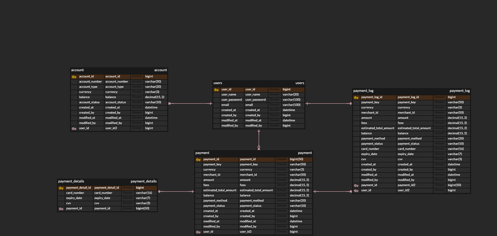

<a name="top">
  
# Simple Payment System
  
</a>

<br>
 

## 1. 요구사항


요구사항

● API 구현: 아래 정의된 세 개의 RESTful API 엔드포인트를 구현하세요.
1. 잔액 조회: /api/payment/balance
2. 결제 예상 결과 조회: /api/payment/estimate
3. 결제 승인 요청: /api/payments/approval

● Request & Response: 각 API의 요청과 응답 형식은 아래에 명시된 대로 구현해야 합니다.

● 데이터베이스 연동: 이 시스템은 사용자와 결제 정보를 저장할 수 있는 데이터베이스(H2)와 연동되어야 합니다. 관련 스키마 설계 및 구현이 필요합니다.

● 단위 테스트: 각 API에 대한 단위 테스트를 작성하여 기능이 올바르게 동작하는지 검증하세요.


## 2. 프로젝트 정보 및 API 테스트 가이드
###  프로젝트 구성

payment-core: 프로젝트에서 사용하는 엔티티 객체들과 공통 Spring Bean을 관리합니다. <br> 
payment-api: API 스키마가 정의된 DTO, API를 구현하기 위한 Controller, Service, Repository 를 관리 합니다. <br>
payment-api -> payment-core 참조 </br>

> 프로젝트 실행은 payment-api 모듈의 "PaymentApplication" 을 실행합니다.

>API 테스트: [Swagger-UI Link](http://localhost:8080/api/swagger-ui/index.html)

>H2 콘솔 접속: [H2 Console Link](http://localhost:8080/api/h2-console/) </br>
>JDBC URL: jdbc:h2:mem:payment;MODE=MySQL </br>
Username: sa </br>
Password: (비워두기)

## 3. DB 스키마





**기술 스택**
* Spring Boot 3.0
* gradle 7.5
* H2 - (MySQL Mode)
* Junit + Assertions
* JPA
## 4.  기능
> swagger-ui : 
http://localhost:8080/api/swagger-ui/index.html
### 잔액조회

**Endpoint**
>GET /api/payment/balance/{userId}

**Response**
```json


{
  "userId": "12345",
  "balance": 1000.00,
  "currency": "USD"
}
```
### 결제예상결과조회
**Endpoint**


>POST /api/payment/estimate

Request

```json
{
  "amount": 150.00,
  "currency": "USD",
  "destination": "merchantId123",
  "userId": "12345"
}
```
Response

```json
{
  "estimatedTotal": 155.00,
  "fees": 5.00,
  "currency": "USD"
}
```
### 결제 승인 요청
Endpoint

> POST /api/payments/approval

Request

```json
{
  "userId": "12345",
  "amount": 200.00,
  "currency": "USD",
  "merchantId": "merchantId123",
  "paymentMethod": "creditCard",
  "paymentDetails": {
    "cardNumber": "1234-5678-9123-4567",
    "expiryDate": "12/24",
    "cvv": "123"
  }
}
```
Response
```json
{
  "paymentId": "paymentId12345",
  "status": "approved",
  "amount": 200.00,
  "currency": "USD",
  "timestamp": "2023-01-23T10:00:00Z"
}
```


  
